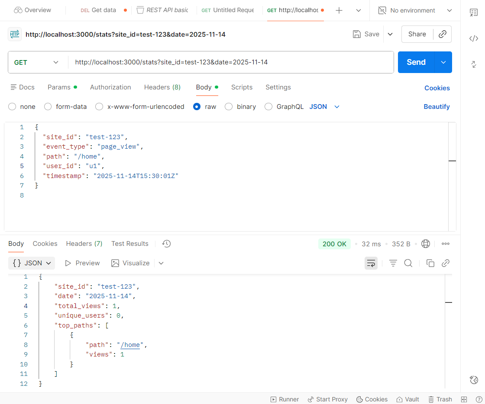
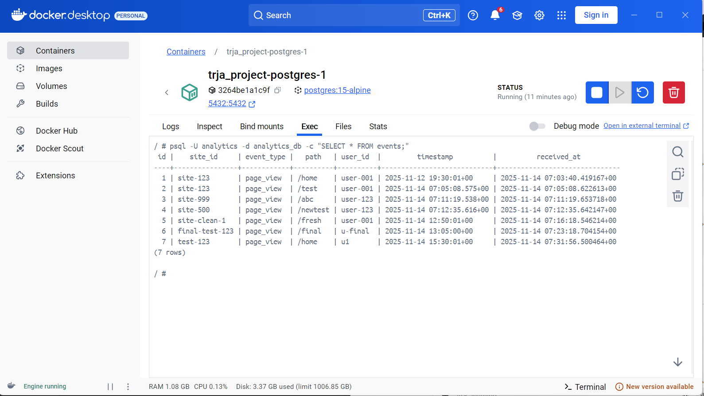
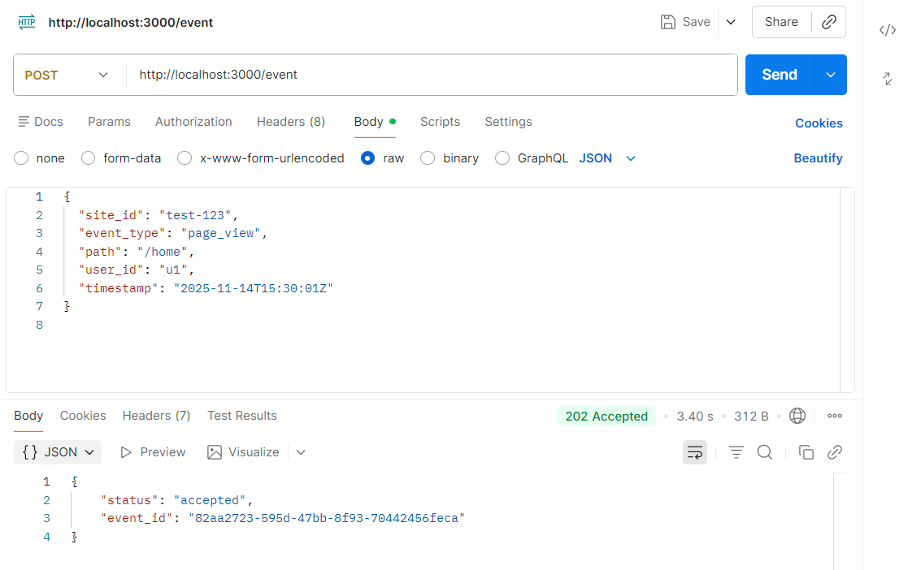

# 📘 QueueFlow Engine
**(Node.js + Redis Streams + PostgreSQL + Docker)**
=============================================================


---
This project implements a scalable, high-performance backend used to capture website analytics events.It supports **fast ingestion**, **asynchronous background processing**, and **real-time reporting** with aggregated analytics.

Designed exactly to meet the assignment requirement:

> _“The ingestion endpoint must be extremely fast, must not wait for database write, and must use an asynchronous queue.”_
---

🚀 1. Architecture Overview
===========================

### ⚙️ System Workflow

```
┌─────────┐     ┌─────────────┐     ┌────────────┐     ┌───────────┐
│ Browser │ --> │ Ingestion   │ --> │ Redis      │ --> │ Worker    │
│ / Client│     │ API (POST)  │     │ Stream     │     │ Processor │
└─────────┘     └─────────────┘     └────────────┘     └────┬──────┘
                                                           │
                                                           v
                                                    ┌────────────┐
                                                    │ PostgreSQL │
                                                    └────┬───────┘
                                                         │
                                                         v
                                                    ┌─────────┐
                                                    │ Reporting│
                                                    │ API (GET)│
                                                    └─────────┘
```


### ✔ Components

#### **1️⃣ Ingestion API — POST /event**

*   Receives analytics events
    
*   Validates input JSON
    
*   Pushes event to Redis Stream (events\_stream)
    
*   Returns **202 Accepted immediately** (non-blocking)
    
*   Ensures high TPS (thousands/sec)
    

#### **2️⃣ Processor (Worker Service)**

*   Pulls events using Redis Consumer Groups
    
*   Inserts raw events into PostgreSQL
    
*   Updates aggregated tables:
    
    *   daily\_site\_stats
        
    *   daily\_site\_path\_counts
        
*   Acknowledges messages (XACK) after successful processing
    
*   Runs continually in background
    

#### **3️⃣ Reporting API — GET /stats**

*   Fetches analytics summaries
    
*   Returns:
    
    *   total views
        
    *   unique users
        
    *   top most visited paths
        

🗄️ 2. Database Schema
======================

### **Table: events**

Stores raw incoming events.

| Column      | Type         | Description         |
| ----------- | ------------ | ------------------- |
| id          | BIGSERIAL PK | Auto-increment      |
| site_id     | TEXT         | Website ID          |
| event_type  | TEXT         | e.g., page_view     |
| path        | TEXT         | URL path            |
| user_id     | TEXT         | User identifier     |
| timestamp   | TIMESTAMPTZ  | When event occurred |
| received_at | TIMESTAMPTZ  | When stored in DB   |


### **Table: daily\_site\_stats**

Stores daily totals per site.

| Column       | Type   |
| ------------ | ------ |
| site_id      | TEXT   |
| date         | DATE   |
| total_views  | BIGINT |
| unique_users | BIGINT |

### **Table: daily\_site\_path\_counts**

Stores daily top path hits.

| Column  | Type   |
| ------- | ------ |
| site_id | TEXT   |
| date    | DATE   |
| path    | TEXT   |
| views   | BIGINT |


🐳 3. Setup Instructions (Using Docker Compose)
===============================================

### **Prerequisites**

*   Docker Desktop
    
*   Git
    

**Step 1 — Clone the Repository**
---------------------------------

```bash
git clone https://github.com/chandu-bala/QueueFlow-Engine.git

cd QueueFlow-Engine
```

**Step 2 — Start All Services**
-------------------------------

```bash   docker compose up --build   ```

This creates:

| Service  | Port | Purpose                   |
| -------- | ---- | ------------------------- |
| API      | 3000 | Ingestion + Reporting API |
| Redis    | 6379 | Event Queue               |
| Postgres | 5432 | Database                  |
| Worker   | —    | Background processor      |


**Step 3 — Create Database Schema**

Create DB schema:
```bash
docker compose exec postgres psql -U analytics -d analytics_db -f /app/migrations/schema.sql
```

Verify tables:
```bash
docker compose exec postgres psql -U analytics -d analytics_db -c "\dt"
```


📬 4. API Usage
===========================================

⭐ 4.1 POST /event (Ingestion API)
=================================

### Example Request :

Endpoint: POST http://localhost:3000/event  
Behavior: Validate payload → XADD to Redis stream `events_stream` → return 202 immediately.

Example cURL:
```json
 '{
    "site_id":"test-123",
    "event_type":"page_view",
    "path":"/home",
    "user_id":"u1",
    "timestamp":"2025-11-14T15:30:01Z"
  }'
```

Expected response:
```json
{
  "status": "accepted",
  "event_id": "<uuid>"
}
```


Tips:
- Ingestion returns quickly because it writes only to Redis, not to Postgres.
- Validate required fields: `site_id`, `event_type`, `path`, `user_id`, `timestamp`.


### GET /stats — Reporting


⭐ 4.2 Redis Queue Verification
==============================

Redis Streams was used because it’s an in-memory, high-speed queue that can handle a huge number of events with almost no delay. It supports consumer groups, ensures ordered processing, and is much lighter than Kafka, making it perfect for fast event pipelines.

After sending POST request:

```bash
docker compose exec redis redis-cli XLEN events_stream
```

Expected:

` (integer) 1` 


⭐ 4.3 Worker Processing
=======================
The ingestion API never writes to the database directly. It only validates the event and pushes it to Redis Streams instantly, then returns success. All heavy work is done later by the background worker, keeping the API extremely fast and non-blocking.


Check worker logs:

```bash
docker compose logs worker --tail=50
```

Expected examples:

Consumer group created
BEGIN
COMMIT
XACK


⭐ 4.4 PostgreSQL Raw Events Storage
===================================
### Postgres checks

List tables:

```bash
docker compose exec postgres psql -U analytics -d analytics_db -c "\dt"
```

Query raw events:
```bash
docker compose exec postgres psql -U analytics -d analytics_db -c "SELECT * FROM events ORDER BY received_at DESC LIMIT 10;"
```


Query aggregated stats:
```bash
docker compose exec postgres psql -U analytics -d analytics_db -c "SELECT * FROM daily_site_stats ;"
```

⭐ 4.5 GET /stats (Reporting API)
================================

Example Request:

Response:

Endpoint: GET http://localhost:3000/stats?site_id=test-123&date=2025-11-14

Example:
```bash
 "http://localhost:3000/stats?site_id=test-123&date=2025-11-14"
```

Example response:
```json
{
  "site_id": "test-123",
  "date": "2025-11-14",
  "total_views": 1,
  "unique_users": 1,
  "top_paths": [
    { "path": "/home", "views": 1 }
  ]
}
```




 ## 📦 Project Structure

 ---

```
QueueFlow-Engine/
│
├── api/
│   ├── src/
│   │   ├── server.js        # Express server: POST /event, GET /stats
│   │   └── db.js            # Postgres client wrapper
│   ├── Dockerfile
│   └── package.json
│
├── worker/
│   ├── src/
│   │   └── worker.js        # Redis stream consumer + DB writer
│   ├── Dockerfile
│   └── package.json
│
├── migrations/
│   └── schema.sql
│
├── docker-compose.yml
└── README.md                
```
---


